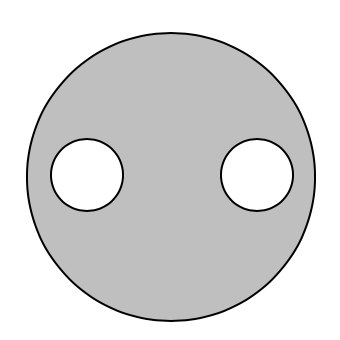
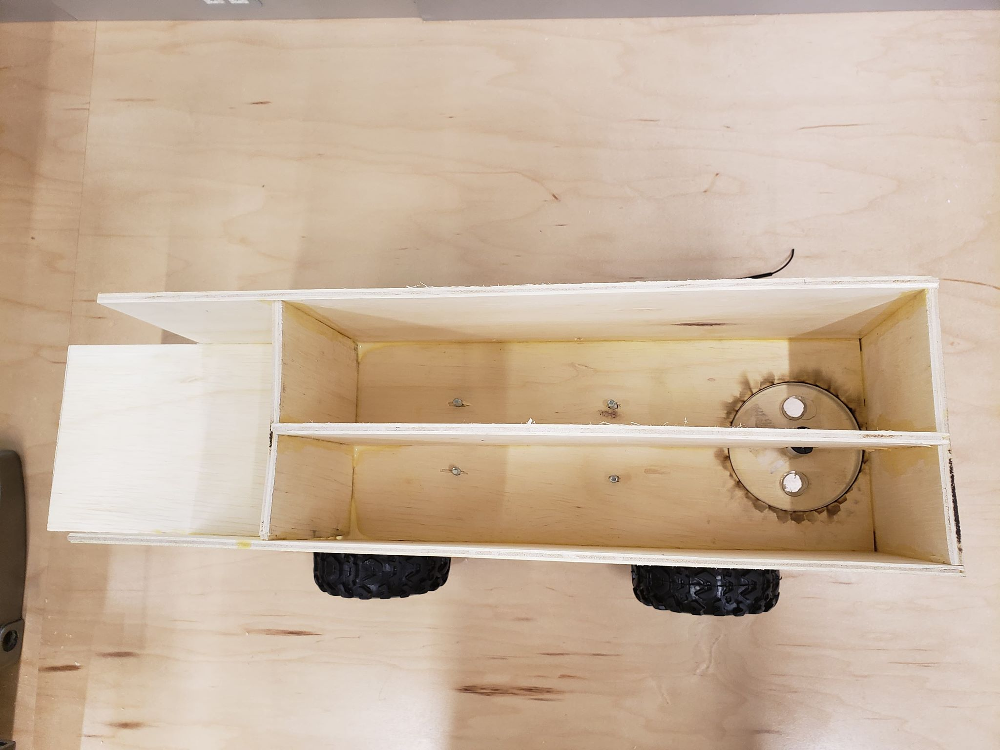
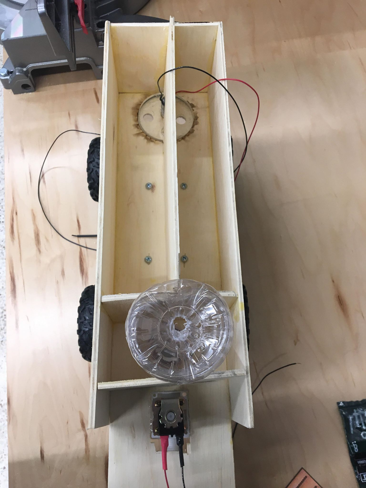
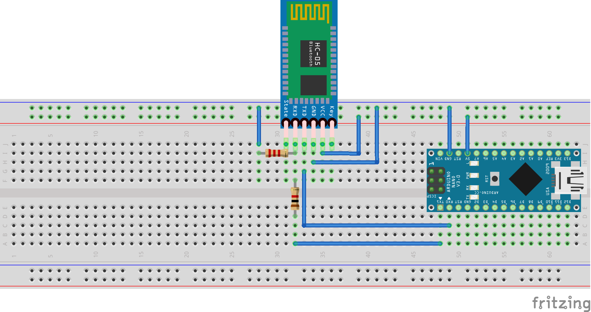

## ECE 4180: Plantr
* Jacob Bruhn
* Caleb Alexander
* Connor Hawley
* Jordan Harvey-Morgan

### Project Idea
Everyone wants fresh food and there is nothing fresher than something grown in your own backyard. However, not everyone likes actually getting their hands dirty. That’s why we created Plantr, your new gardening assistant. Simply drive this modified RC Car around your garden and drop seeds, fertilizer, and water like a pro. 

### Materials
* ~5 sq ft of 1/4” wood
* ~4 sq inch of acrylic
* RC Car
* 4 nuts and bolts
* DC motor
* 2 Arduino Nanos
* 2 HC-05 Module Bluetooth Serial
* 2 3060NL Power MOSFETS
* 1 Adafruit Solenoid Valve
* 1 Plastic bottle
* Wood Glue and Hot Glue

### Assembly Instructions
1. Cut Wood Pieces
  * A: 17x5 in
  * B: 17x5 in
  * C: 5x5 in
  * D: 12.25x5 in
  * E: 4.5x4.5 in
  * F: 4.5x4.5 in
  * G: 4.5x4.5 in
  * H: 20x5 in
2. Cut acrylic into circle with a 2" diameter.
3. Cut (2) 0.5" diameter circles, like so: 
   
   
4. On E, trace out the above image.
5. On E, cut ONLY (2) 0.5" circles
6. On H, cut a 2" diameter circle out. 
   * The top of the circle should be 1/8" from the end of the plank
   * Circle should be centered
7. Make sure acrylic fits in the new cut out on H.
8. Glue E and H together with wood glue, so that the 0.5" circles are within the 2" diameter cut out.
9. Cut a 2" notch in D
10. Glue solenoid into the new notch in D
11. Glue all boards together. The solenoid should be above the acrylic, like so: 
    
    
12. Cut a 1"x2" rectangle at the end of H, so that it fits the water dispenser.
13. Drill a hole 2.5" above the rectangle, in order to dispense water. It should look similar to this:
    
    

### Bluetooth Instructions
1. Wire 2 HC-05 bluetooth modules and Arduino Nanos according to diagram below:

   
2. Upload [Master Bluetooth Code](masterCodeUI.ino) to one Ardruino Nano.
3. Upload [Slave Bluetooth Code](slaveCode.ino) to the other Arduino Nano.

### PCB Schematic
      
      
      

### Support or Contact

Having trouble with Pages? Check out our [documentation](https://help.github.com/categories/github-pages-basics/) or [contact support](https://github.com/contact) and we’ll help you sort it out.
